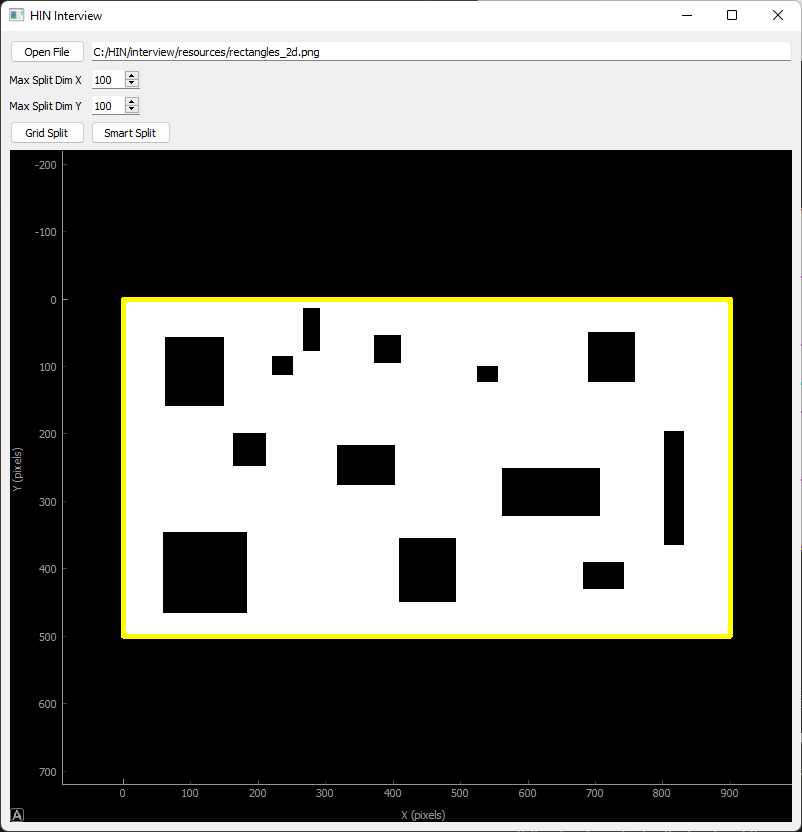
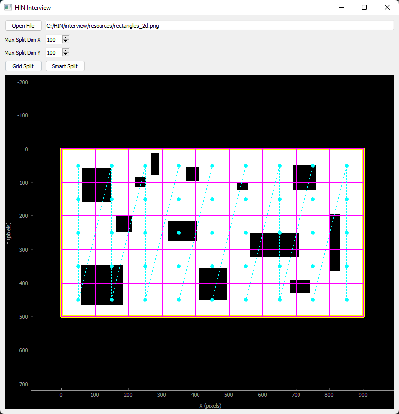

# Heidelberg Instruments Nano: Coding Assignment

## Introduction

This coding assignment will introduce you to some of the frameworks we use at Heidelberg Instruments Nano.

The NanoFrazor software runs on a Windows PC and communicates with the embedded systems controller in the NanoFrazor tool through a USB connection.

Below are the different components of our software:

* Embedded Application - interacts with the hardware and runs all the real-time control algorithms (C, Assembly Language)
* Core Library - brain of the NanoFrazor software (a C++ DLL)
* User Interface - python API for the core library and a Qt GUI

## Getting Started

### Prerequisites
Before you proceed with the coding assignment, please ensure that you meet the prerequisites stated below. If not, please contact us.

* A BitBucket account
* A Windows PC (x64)
* Access rights to install and setup a development environment for the coding assignment

### Install
Install the software below. Please use the versions and paths mentioned below for the setup scripts to work correctly.

* Visual Studio 2022 Community Edition (select desktop development for C++)
* Python 3.8
    * Set install location to `C:\Python38` in the installer
    * Check *Add Python to environment variables*
* Swig 4.0.2 (bin path: `C:\swig\swigwin-4.0.2`)
* CMake 3.23.0
    * Check *Add CMake to the system PATH for the current user* in the installer
* OpenCV - download [link](https://drive.google.com/file/d/1KRNMY8Wj6Jb9ddQbB44aYpK2hLh6tF73/view?usp=sharing)
    * Extract zip file to `C:\vc\` directory

### Setup
* Clone this git repository to `C:\HIN\interview`
* Open the windows command prompt
    * `cmd`
* Setup the Python virtual environment with all the required modules by executing the below batch script
    * `C:\HIN\interview\setup.bat`
* Activate the virtual environment using the command
    * `workon hin`

### Build
Use CMake to generate the Visual Studio Project by following these steps:

* `cd C:\HIN\interview\app`
* `mkdir build`
* `cd build`
* `cmake .. -G "Visual Studio 17 2022"`
* Open `interview.sln` in `C:\HIN\interview\app\build` and build the solution in Visual Studio
* This should generate the required DLLs and Python modules in `C:\HIN\interview\app\lib\win64\dll`

### Run

* `python C:\HIN\interview\app\py\main_window.py`
    * Make sure that you are in the `hin` virtual environment for the build and run steps

If you see the below GUI, you're ready to proceed with the coding task. Please contact us if you encounter any problems in getting the above steps to work.

## Image Importer

The NanoFrazor uses an ultra-sharp heatable probe tip for writing and simultaneous inspection of complex nanostructures. One way of defining these target geometries is by image files where the pixel sizes are defined in nanometers and the image graylevels are mapped to target depths.

The NanoFrazor has 2 positioning systems:

* A fast scanning system with a range of few micrometers in both X and Y axes
* A coarse positioning system with a range of few centimeters  in both X and Y axes

When users import images much larger than the range of the scanner, they need to be split into multiple smaller cells.
In order to pattern a cell, the NanoFrazor first moves to the center of the cell using the coarse position system and then patterns it using the fast scanning system.
This process is then repeated for all the cells until the entire geometry is patterned.

A simple approach is to split the image in a uniform grid. The result of such an approach can be seen by clicking the *Grid Split* button on the GUI.

In the above image, the file `C:/HIN/interview/resources/rectangles_2d.png` is opened and is split using the grid split approach, with a maximum split size of 100 in both X and Y.

**Graph Legend**

* Yellow border indicates the border of the opened image
* Pink borders indicate the borders of the split cells
* Blue path indicates the coarse stage path to move from one cell center to the next

**Drawbacks**

As all the test images (in `C:/HIN/interview/resources`) have several unconnected components of different sizes, this approach has several drawbacks:

* There are cells which are completely empty - white pixels are not patterned
* The cells which are not completely empty still have extra white space which the scanner has to unnecessarily scan
* The traversal order of the cells is not optimized - the coarse stage jumps back to the start of the next column after finishing a column

The goal of this assignment is to improve the splitting functionality and the patterning order of these cells.

## Tasks

Implement functionality in `Splitter::smartSplit` for the *Smart Split* button in `C:\HIN\interview\app\lib\src\Splitter.cpp`. 

1. Skip completely empty cells - A cell with all white pixels should not be part of the result.

2. *Auto Crop* cells to the smallest bounding box - Shrink the size of the cell so that there are no rows or columns with all white pixels. This results in cells which might be of unequal dimensions.

3. Optimize the traversal order of cells so that nearby cells are patterned together - Minimize the distance travelled by the coarse stage. Cells containing a single unconnected component should be patterned together before moving on to cells containing other unconnected components.

4. (Optional) Minimize the splitting of structures - Identify unconnected components and place a cell encompassing the whole structure if possible.

Test your *Smart Split* functionality on all the images in `C:/HIN/interview/resources` and compare them with the *Grid Split* approach.

## General Remarks

* Comment your code wherever appropriate
* Add any general remarks or refactoring ideas you have for the given code
* State any assumptions you made and why
* Add tests if applicable
* For the submission, please clone this repository into a private repository, add your solution and give read access to software-nano@himt.ch
